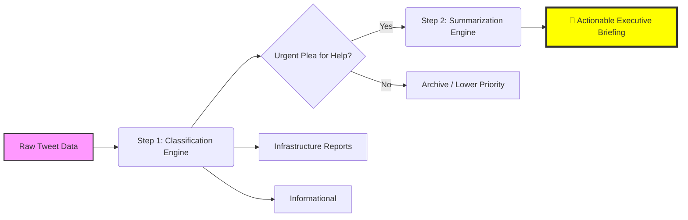
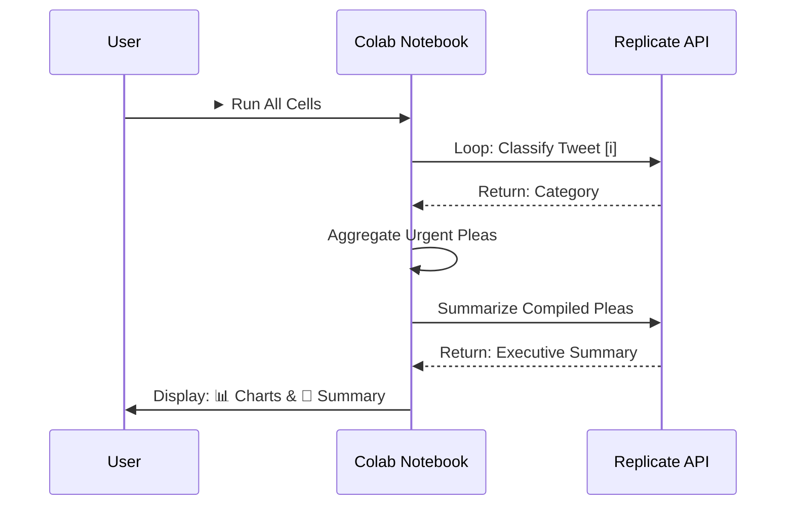

# 🚨 AI-Powered Emergency Dispatch Optimizer

**Capstone Project for the Student Development Initiative (Hacktiv8 x IBM)**
*A proof-of-concept leveraging NLP to transform disaster response through real-time social media analysis.*

[]([https://colab.research.google.com/github/Thyco5/AI-Disaster-Response-Classifier/blob/main/Disaster_Tweet_Analysis.ipynb](https://colab.research.google.com/drive/1eXYfCWhLX8S-oHhJpsMSnYzQMfbxUc5i?usp=sharing))

---

## 🌟 Project Impact & Key Features

This project demonstrates how AI can empower emergency response teams like Indonesia's **BNPB** to:
- **Filter Critical Signals:** Instantly separate urgent pleas from social media noise.
- **Reduce Triage Time:** Cut down analysis time from hours to minutes.
- **Prioritize Life-Saving Actions:** Intelligently categorize reports for efficient resource allocation.
- **Generate Actionable Intelligence:** Summarize complex situations into concise executive briefings.

---

## ⚙️ Technical Workflow

This project uses a dual-phase AI process for maximum impact:



---

## 📊 Key Outputs & Analysis

### 1. Classification Distribution
*[-- PLACEHOLDER: This chart will be generated by the notebook and added here after running the analysis. --]*


### 2. AI-Generated Executive Summary
*[-- PLACEHOLDER: This summary will be generated by the notebook and added here after running the analysis. --]*
> 🚨 **CRITICAL SITUATION BRIEFING** 🚨
>
> * **Recurring Theme: Flooding & Trapped Individuals:** Multiple reports indicate families trapped by rising floodwaters, particularly in multi-story buildings.
> * **Key Infrastructure Damage:** Reports of a collapsed bridge on a major highway are hindering evacuation efforts.
> * **Medical Emergencies:** Several urgent requests for medical assistance, including for elderly individuals and those with injuries.

---

## 🚀 How to Run the Analysis

1.  **Clone the Repository:**
    ```bash
    git clone https://github.com/Thyco5/AI-Disaster-Response-Classifier.git
    cd AI-Disaster-Response-Classifier
    ```
2.  **Set Up Environment:** Ensure you have the required dependencies installed.
    ```bash
    pip install -r requirements.txt
    ```
3.  **Configure API Key:** Open `Disaster_Tweet_Analysis.ipynb` in Google Colab. Add your Replicate API key to Colab Secrets with the name `REPLICATE_API_TOKEN`.
4.  **Execute:** Run all notebook cells sequentially to perform the analysis and generate outputs.

### Execution Flow


---

## 📂 Dataset & AI Model

- **Dataset:** [Real or Not? NLP with Disaster Tweets](https://www.kaggle.com/competitions/nlp-getting-started) - A collection of 10,000+ hand-labeled disaster-related tweets.
- **AI Model:** **IBM Granite-3.3-8b-instruct** accessed via the Replicate API.

---

## 📚 Dependencies
A full list of dependencies is available in the `requirements.txt` file.
