# 🚨 AI-Powered Emergency Dispatch Optimizer

**Capstone Project for the Student Development Initiative (Hacktiv8 x IBM)**
*A proof-of-concept leveraging NLP to transform disaster response through real-time social media analysis.*

[](https://colab.research.google.com/github/Thyco5/AI-Disaster-Response-Classifier/blob/main/Disaster_Tweet_Analysis.ipynb)

---

## 🌟 Project Impact & Key Features

This project demonstrates how AI can empower emergency response teams like Indonesia's **BNPB** to:
- **Filter Critical Signals:** Instantly separate 10% of urgent pleas from 90% of social media noise.
- **Reduce Triage Time:** Cut down analysis time from hours to minutes.
- **Prioritize Life-Saving Actions:** Intelligently categorize reports for efficient resource allocation.
- **Generate Actionable Intelligence:** Summarize complex situations into a concise executive briefing.

---

## ⚙️ Technical Workflow

This project uses a dual-phase AI process for maximum impact:

```mermaid
graph LR;
    A[Raw Tweet Data] --> B(Step 1: Classification Engine);
    B --> C{Urgent Plea for Help?};
    C -- Yes --> D(Step 2: Summarization Engine);
    C -- No --> E[Archive / Lower Priority];
    B --> F[Infrastructure Reports];
    B --> G[Informational];
    D --> H[🚨 Actionable Executive Briefing];

    style A fill:#f9f,stroke:#333,stroke-width:2px;
    style H fill:#ff0,stroke:#333,stroke-width:4px;
```



---

## 📊 Key Outputs & Analysis

### 1. Classification Distribution
The initial classification of 100 sample tweets reveals that the vast majority of posts are either irrelevant noise or reports on infrastructure. Only a critical 10% are actual urgent pleas for help, highlighting the need for this AI-powered filter.


### 2. AI-Generated Executive Summary
After isolating the 10 'Urgent Plea for Help' tweets, the AI generated the following intelligence briefing:

> 🚨 **EXECUTIVE SUMMARY OF URGENT PLEAS** 🚨
>
> 1. The urgent pleas indicate a multi-faceted disaster scenario, potentially involving an earthquake, wildfire, severe weather (tornado), and flooding, primarily affecting South Tampa.
> 2. There are reports of immediate evacuations due to structural damage or fire, with specific mention of a building across the street.
> 3. Multiple instances of fires, including a wildfire and a potential structure fire, are reported, with one person expressing a fear of being "set ablaze."
> 4. Several accounts of recent accidents (car and potentially other unmentioned types) are shared, highlighting the need for potential rescue and medical assistance.
> 5. The disaster's impact is causing distress and raising concerns about personal safety, property damage, and long-term financial and medical support for those affected.

---

## 🚀 How to Run the Analysis

1.  **Clone the Repository:**
    ```bash
    git clone https://github.com/Thyco5/AI-Disaster-Response-Classifier.git
    cd AI-Disaster-Response-Classifier
    ```
2.  **Set Up Environment:** Ensure you have the required dependencies installed.
    ```bash
    pip install -r requirements.txt
    ```
3.  **Configure API Key:** Open `Disaster_Tweet_Analysis.ipynb` in Google Colab. Add your Replicate API key to Colab Secrets with the name `REPLICATE_API_TOKEN`.
4.  **Execute:** Run all notebook cells sequentially to perform the analysis and generate outputs.

### Execution Flow

```mermaid
sequenceDiagram;
    participant User;
    participant Colab Notebook;
    participant Replicate API;

    User->>Colab Notebook: ► Run All Cells;
    Colab Notebook->>Replicate API: Loop: Classify Tweet [i];
    Replicate API-->>Colab Notebook: Return: Category;
    Colab Notebook->>Colab Notebook: Aggregate Urgent Pleas;
    Colab Notebook->>Replicate API: Summarize Compiled Pleas;
    Replicate API-->>Colab Notebook: Return: Executive Summary;
    Colab Notebook->>User: Display: 📊 Charts & 📝 Summary;
```


---

## 📂 Dataset & AI Model

- **Dataset:** [Real or Not? NLP with Disaster Tweets](https://www.kaggle.com/competitions/nlp-getting-started) - A collection of 10,000+ hand-labeled disaster-related tweets.
- **AI Model:** **IBM Granite-3.3-8b-instruct** accessed via the Replicate API.

---

## 📚 Dependencies
A full list of dependencies is available in the `requirements.txt` file.
